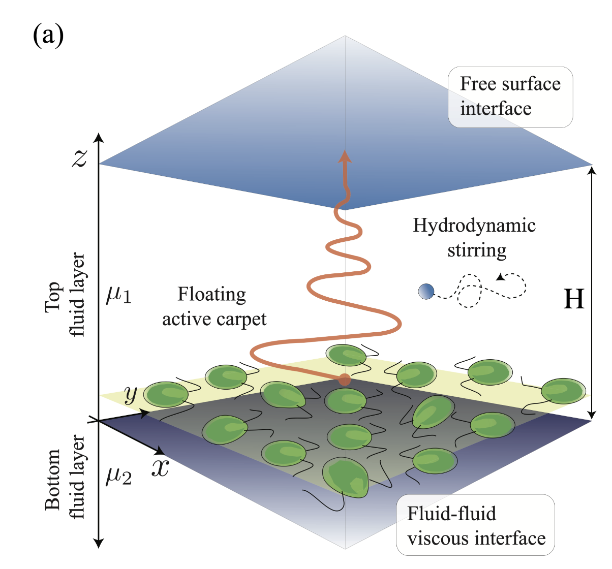
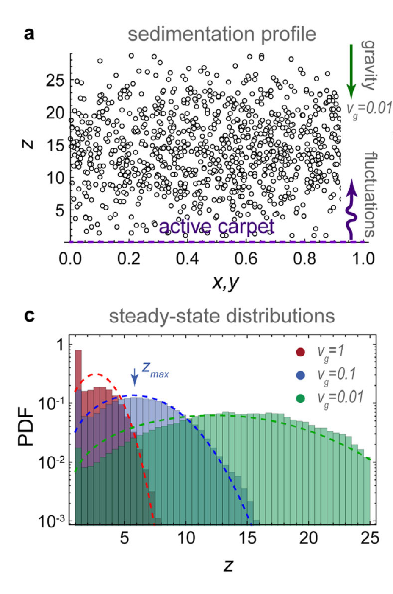
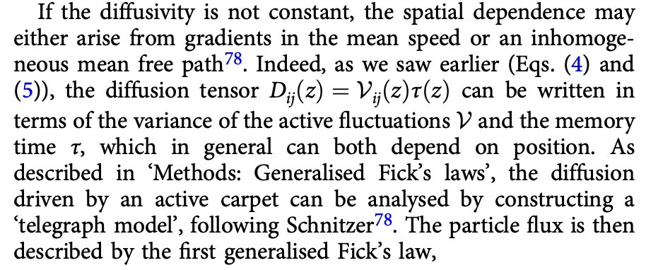
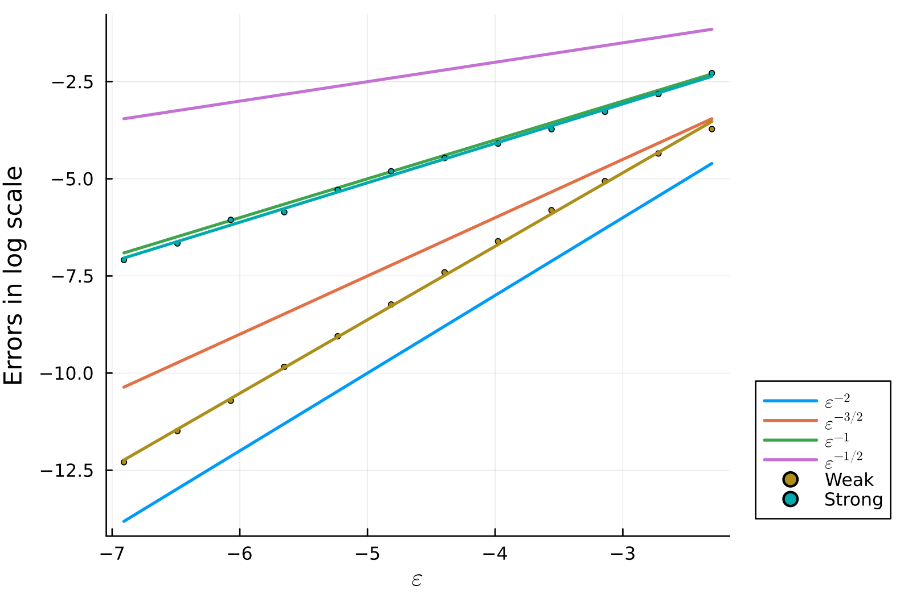

# Original motivation {background-color="#F5C946"}

##
</img>

## Steady states of particles in incompressible flow

:::: {.columns}

::: {.column width="60%"}
</img>
:::

::: {.column width="40%"}
</img>
:::

::::

Source: @Guzman-LastraLowenMathijssenActiveCarpets2021

## 

<video
  data-autoplay
  loop
  src="images/Langevin/Guzman.mp4"
  width="70%" height="70%"
></video>

Source: @Guzman-LastraLowenMathijssenActiveCarpets2021

## Concerns 

- The model for particles was  the advection-diffusion equation
  $$ \partial_t \rho + \nabla \cdot (\bf{v} \rho) = \kappa \Delta \rho $$
  $$ \nabla \cdot \bf{v} = 0 $$

- Unverified assumption
</img>

## How can one capture the non-uniformity in this system? {.center}

# Climate {background-color="#F5C946"}

## {auto-animate=true}
</img>

## {auto-animate=true}
</img>

Source: [https://climatereanalyzer.org/clim/t2_daily/?dm_id=tropics](https://climatereanalyzer.org/clim/t2_daily/?dm_id=tropics)

# Fast-slow system 

## 

### General

\begin{cases} 
  \dot X^\epsilon_t = f(X^\epsilon_t, Y^\epsilon_t, t)  \\  
  Y^\epsilon_t \sim \xi^\epsilon_{t/\epsilon}
\end{cases}

## 

### General

\begin{cases} 
  \dot X^\epsilon_t = f(X^\epsilon_t, Y^\epsilon_t, t)  \\  
  Y^\epsilon_t \sim \xi^\epsilon_{t/\epsilon}
\end{cases}

### Random fast system 
Let $\tau = t/\epsilon$ and $\xi^\epsilon$ satisfies
$$
   d \xi^\epsilon_{\tau}  =  g(X^\epsilon_{\tau},  \tau)d\tau +  h(X^\epsilon_{\tau}, \tau) dW_{\tau}
$$
$$
d\tau = \frac{dt}{\epsilon} \qquad d W_{\tau} =  d W_{t/\epsilon} \sim \frac{1}{\sqrt\epsilon} dW_t
$$

## 

### General

\begin{cases} 
  \dot X^\epsilon_t = f(X^\epsilon_t, Y^\epsilon_t, t)  \\  
  Y^\epsilon_t \sim \xi^\epsilon_{t/\epsilon}
\end{cases}

### Random fast system 

\begin{cases} 
  d X^\epsilon_t &= f(X^\epsilon, Y^\epsilon_t, t) dt  \\  
  \epsilon d Y^\epsilon_t  &=  g(X^\epsilon_t,  Y^\epsilon_t,t)dt + \sqrt{\epsilon} h(X^\epsilon_t, Y^\epsilon_t,t) dW_t
\end{cases}

## 

### General

\begin{cases} 
  \dot X^\epsilon_t = f(X^\epsilon_t, Y^\epsilon_t, t)  \\  
  Y^\epsilon_t \sim \xi^\epsilon_{t/\epsilon}
\end{cases}

### Random fast system 

\begin{cases} 
  d X^\epsilon_t &= f(X^\epsilon, Y^\epsilon_t, t) dt  \\  
  \epsilon d Y^\epsilon_t  &=  g(X^\epsilon_t,  Y^\epsilon_t,t)dt + \sqrt{\epsilon} h(X^\epsilon_t, Y^\epsilon_t,t) dW_t
\end{cases}

### Langevin 

\begin{cases} 
  d X^\epsilon_t &= Y^\epsilon_t dt  \\  
  \epsilon d Y^\epsilon_t  &=  (- Y^\epsilon_t + b(X^\epsilon_t, t)   )dt + \sqrt{2 \epsilon}  dW_t
\end{cases}

## Problem {.center}

Expensive to simulate

## Averaging Principle {.center}
::: {.callout-note}
## Under appropriate regularity conditions 
Suppose 
$$
\lim_{\epsilon \to 0} \lim_{T \to \infty} \frac{1}{T} \int_0^T f(x, Y^\epsilon_s,t) \, ds = \bar f(x, t) \,.
$$
Then $X^\epsilon \to  X$, where
$$
\dot X_t = \bar f(X_t, t) \,.
$$
:::

_Random Perturbations of Dynamical Systems_, @FreidlinWentzellRandomPerturbations2012

## Rate of convergence {.center}
::: {.callout-note}
## Under appropriate regularity conditions

Given $T>0$ and $\varphi \in C^\infty(\mathbb{T}^n)$. There exists a constant $C$ such that
\begin{equation}
        \sup_{t \in [0, T]} \mathbb E \left| X^\epsilon_t - X_t  \right| \leq C\epsilon^{1/2}
\end{equation}
and
\begin{equation}
        \sup_{t\in [0, T]} \left| \mathbb E \varphi(X^\epsilon_t) - \mathbb E \varphi(X_t)  \right|
        \leq C \epsilon \,.
\end{equation}
:::
@RocknerSunXieStrongWeak2019 (for a much more general system)

## Idea {.center}

- Write the Fokker-Planck equation

$$
	\partial_{t} \rho^\epsilon + \nabla_x \cdot (f \rho^\epsilon) + \epsilon^{-1}\nabla_{v}\cdot(g \rho^\epsilon) - \epsilon^{-1} \sum_{ij} H_{ij}\frac{\partial^2}{\partial v_i \partial v_j} \rho^\epsilon = 0 \,.
$$

. . .

- Use hypoellipticity to control $\nabla_x \rho^\epsilon$ and $D^2_x \rho^\epsilon$

# Can we __cheaply__ approximate the system __more efficiently__? {.center background-color="#F5C946"}

## Previous works

::: {.callout-tip}
## Hasselmann's scheme (@HasselmannStochasticClimate1976) -- Nobel 2021
Let $H^\epsilon$ be solution of
$$ dH^\epsilon_t = \bar f (H^\epsilon_t, t)  dt + \sqrt{\epsilon} \sigma(H^\epsilon_t) dW_t $$
where
$$ \sigma^* \sigma (x) = a (x)$$ and $a(x)$ is the correlation matrix satisfying
$$ a_{ij}(x) = \lim_{\epsilon \to 0} \lim_{T\to \infty}   \mathbb{E} \int_0^T (f_i(x, \xi^\epsilon_s, t) - \bar f_i(x,t)) \, ds \int_0^T (f_j(x, \xi^\epsilon_s) - \bar f_j(x,t)) \, ds \,.$$
:::

. . .

::: {.callout-important}
## Open problem
  $$
  \sup_{0\leq t \leq T} \mathbb{E} | X^\epsilon_t - H^\epsilon_t | \leq \epsilon^?\,.
  $$
:::

## 
::: {.callout-note}
##  Theorem (@BakhtinKiferDiffusionApproximation2004)
  $$
  \sup_{0\leq t \leq T}\mathbb{E} | X^\epsilon_t - H^\epsilon_t | \leq \epsilon^{1/2 + \delta} \,.
  $$
for any $\delta \in (0,1/(18+8n))$.
:::

. . . 

__Idea__

1. Use the central limit theorem of @KhasminskiiStochasticProcesses1966
$$
\frac{ X^\epsilon_t - X_t}{\sqrt \epsilon} \to R_t
$$

. . .

2. Approximate $X^\epsilon_t$ and $H^\epsilon_t$ by
   $$
    K^\epsilon_t = X_t  + \sqrt{\epsilon} R_t \,.
   $$

## Kinetic Langevin {.center}

\begin{cases} 
  d X^\epsilon_t &= Y^\epsilon_t dt  \\  
  \epsilon d Y^\epsilon_t  &=  (- Y^\epsilon_t + b(X^\epsilon_t, t)   )dt + \sqrt{2 \epsilon}  dW_t
\end{cases}

## Case $b= 0$
$$
         X^\epsilon_t =
        \epsilon(1 - e^{-t/\epsilon}) Y^\epsilon_0 +
        \sqrt{2\epsilon} W_t - \sqrt{2\epsilon} \int_0^t e^{-(t-s)/\epsilon} \, dW_s \,.
$$

$$ H^\epsilon_t = \sqrt{2\epsilon} W_t $$

. . .

Subtract the above from each other and by Ito  isometry

\begin{equation*}
        \mathbb E \left|  X^\epsilon_t - H^\epsilon_t \right|^2
        \leq C\epsilon^2 + 2\epsilon \int_0^t e^{-2(t-s)/\epsilon} \, ds \leq  C \epsilon^2 
\end{equation*}

. . .

So
$$
\sup_{0\leq t \leq T} \mathbb{E} | X^\epsilon_t - H^\epsilon_t | \leq \epsilon
$$

# Direct approach on Kinetic Langevin {.center}

## Langevin

\begin{cases} 
  d X^\epsilon_t &= Y^\epsilon_t dt  \\  
  \epsilon d Y^\epsilon_t  &=  (- Y^\epsilon_t + b(X^\epsilon_t, t)   )dt + \sqrt{2 \epsilon}  dW_t
\end{cases}

. . .

Integral form

\begin{align*}
	X^\epsilon_t
	 & = X^\epsilon_0 + \int_0^t Y^\epsilon_s \, ds                                                                         \\
	 & = X^\epsilon_0 +
	\int_0^t \left(  e^{-s/\epsilon} Y_0 + \frac{1}{\epsilon}\int_0^s  e^{-(s-r)/\epsilon} b(X^\epsilon_r, r) \, dr \right) ds \nonumber \\
	 & \qquad + \sqrt{\frac{2}{\epsilon}} \int_0^t\int_0^s e^{-(s-r)/\epsilon} \, dW_r  \, ds \,.
	\label{eq:Langevin-solution}
\end{align*}

##
Rewirte the equation for $X^\epsilon_t$
	\begin{align*}
		dX^\epsilon_t    & =  \left( A(X^\epsilon_t,t) + V^\epsilon_t  \right) dt\,,               \\
		dV^\epsilon_t & = -\frac{V^\epsilon_t}{\epsilon} \, dt + \sqrt{\frac 2 \epsilon} dW_t \,,
	\end{align*}
	where
	\begin{align*}
		A(X^\epsilon_t,t) &=  b_0 e^{-t/\epsilon} + \frac{1}{\epsilon} \int_0^t e^{-(t-s)/\epsilon} b(X^\epsilon_s,s) \, ds  \\
                & =  b(x(t),t) \\ 
                &- \int_0^t e^{-(t-s)/\epsilon} \left(\partial_t b(X^\epsilon_s,s) + D b(X^\epsilon_s,s)\, \dot X^\epsilon_s \right)  \, ds \\
                & \approx b(X^\epsilon_t,t) - \epsilon \left( \partial_t b(X^\epsilon_t,t) + Db(X^\epsilon_t,t) \, \dot X^\epsilon_t \right)  
	\end{align*}
        
## 

$$
  dX^\epsilon_t     \approx b(X^\epsilon_t,t) dt - \epsilon \left( \partial_t b(X^\epsilon_t,t) + Db(X^\epsilon_t,t) \, \dot X^\epsilon_t \right) dt  + V^\epsilon_t   dt               
$$

. . .

But $\dot X^\epsilon_t \approx b(X^\epsilon_t,t)$.

. . .

::: {.callout-note}
## Proposed scheme
\begin{align*}
dZ^\epsilon_t 
&= b(Z^\epsilon_t,t) dt - \textcolor{red}{\epsilon} \left( \partial_t b(Z^\epsilon_t,t) + Db(Z^\epsilon_t,t) \, b(Z^\epsilon_t,t) \right) dt 
+ \sqrt{2 \epsilon} dW_t \\
&= b(Z^\epsilon_t,t) dt - \textcolor{red}{\epsilon} \left( \mathcal{T}b \right) dt 
+ \sqrt{2 \epsilon} dW_t \\
  &= F(Z^\epsilon_t,t) \, dt 
+ \sqrt{2 \epsilon} dW_t 
\end{align*}
where $F = b - \epsilon (\partial_t b + D_x b b)$.
:::
Fokker-Planck equation

\begin{equation}
	\partial_t u^\epsilon + \nabla_x \cdot \left(
	F u^\epsilon\right) - \epsilon \Delta_x u^\epsilon = 0 
	\label{eq:PDEApprox}
\end{equation}

## (Surprised) Relation to Turbulence 

From _Introduction to Turbulent Transport of Particles, Temperature and Magnetic Fields_ by @RogachevskiiIntroductionTurbulent2021

::: {layout="[30,70]"}

Using Feynman's path integral, one may formally derive

:::

# Result {.center background-color="#F5C946"}

##  {auto-animate=true .center}

::: {.callout-note}
## Theorem? (Mori, Sintavanuruk, V., 2025+)
Assume $Y^\epsilon_0 \sim \mathcal N(b(X_0, 0), 1)$ and smooth velocity field $b$.
For each $T>0$, there exists $C>0$ such that
\begin{equation}
        \sup_{t \in [0,T]}\mathbb E \left| X^\epsilon_t - Z^\epsilon_t \right| \leq C \epsilon \,.
\end{equation}
Furthermore, for every $\varphi \in C^\infty(\mathbb T^n)$, there exists $C > 0$ such that
\begin{equation}
        \sup_{t \in [0,T]}\left|\mathbb E \left[\varphi(X^\epsilon_t) - \varphi(Z^\epsilon_t)\right] \right|
        \leq  C \epsilon^{2}\,.
\end{equation}
:::

. . .

::: {.callout-warning}
## Conjecture for Hasselmann's scheme follows as corollary
$$ \sup_{0\leq t \leq T} \mathbb E | X^\epsilon_t - H^\epsilon_t | \leq \epsilon. $$
:::

## Proof idea (stay tuned for the paper coming soon!) {.center}

- Combination of using the integral form of the SDE to carefully control 

$$ A(X^\epsilon_t, t) - F(Z^\epsilon_t,t) $$

**Difficulty:** quantify the difference between

$$\sqrt{\frac{2}{\epsilon}}\int_0^t Q(X^\epsilon_s,s) P^\epsilon_s \, ds$$

$$\sqrt{2\epsilon} \int_0^t Q(X^\epsilon_s,s) dW_s$$

where $P_t = \int_0^t e^{-(t-s)/\epsilon} \, dW_s$.

##

### Pros
Avoid using hypoellipticity

### Cons
Assume regularity of velocity field

A PDE proof (which will involve hypoellipticity) might overcome the cons.

## Simulation {auto-animate=true}

::: {layout="[30,70]"}

::: {}
Monte-Carlo simulation to determine 
weak and strong convergence.
Averaging over 500,000 trajectories
via SRIW1 method from Julia.
:::

::: {}

:::

::::

## Large time simulation {auto-animate=true}

::: {layout="[45,55]"}

::: {}
Original system
:::

::: {}

:::

::::

## Large time simulation {auto-animate=true}

:::: {layout="[40,60]"}

::: {}
Top Left: MSV   

Top Right: Hasselmann 

Bottom Left: Bakhtin-Kifer 

Bottom Right: Li-Xie-Wang (non-diffusion)
:::

::: {}

:::

::::

## Summary

One can approximate

\begin{cases} 
  d X^\epsilon_t &= Y^\epsilon_t dt  \\  
  \epsilon d Y^\epsilon_t  &=  (- Y^\epsilon_t + b(X^\epsilon_t, t)   )dt + \sqrt{2 \epsilon}  dW_t
\end{cases}

by

| **Equation**                                                                 | **Strong Error**     | **Weak Error**     |
|------------------------------------------------------------------------------|-----------------------|---------------------|
| $dX_t = b\,dt$ [Rockner et al., 2019]                                        | $\sqrt{\varepsilon}$ | $\varepsilon$       |
| $dX_t = b \, dt + \sqrt{\varepsilon}\,dW_t$ [Hasselmann, 1976]               | $\varepsilon$        | $\varepsilon$       |
| $dX_t = (b - \varepsilon \mathcal{T} b) \, dt + \sqrt{\varepsilon}\,dW_t$    | $\varepsilon$        | $\varepsilon^2$     |

. . .

Rates for more general systems are still unknown and very difficult to understand. 

## Future

- Rigorous proof/disproof of large time behavior
- Generalization
- Different scaling regimes
- PDE proof
- Enhanced diffusion from homogenization of inertial particles
- Apply to physical models

## Thank you! {background-color="#006666"}

